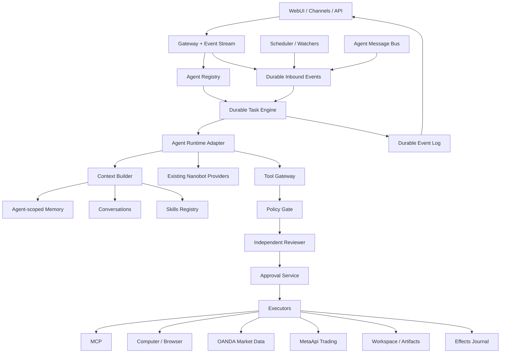

# 04 — البنية المستهدفة وخريطة الملفات

## 1. البنية المستهدفة



## 2. KEEP / EXTEND

من الشجرة والمحتوى المرسل، نريد الاحتفاظ قدر الإمكان بـ:

- provider registry والـprovider implementations.
- tool discovery/registry.
- MCP support.
- SKILL.md loader.
- Dream/consolidation concept.
- Channels.
- WebSocket/WebUI transport.
- workspace security وnetwork checks.
- bwrap sandbox.
- session/history compatibility.
- local trigger durability ideas.
- runtime/progress events.
- LLM usage tracking.
- existing subagents كـephemeral workers.

## 3. REFACTOR

- Session routing: يصبح `Agent → Conversation` بدل Session كهوية النظام العليا.
- MessageBus: يبقى transport، لا source of truth للمهام.
- Cron/Automation: يصبح Agent-owned durable routines/watchers.
- Memory: تصبح Agent namespace بدل workspace-singleton فقط.
- Subagent/session messaging: نضيف persistent Agent messaging منفصل.
- WebUI: Agent-first بدل chat-first.
- secrets: ننتقل من config/env فقط إلى secret references للتكاملات الحساسة.

## 4. NEW subsystems

أسماء مقترحة فقط، وليست مفروضة قبل قراءة checkout الفعلي:

```text
nanobot/persistence/
nanobot/agents/
nanobot/task_engine/
nanobot/event_store/
nanobot/policy/
nanobot/approvals/
nanobot/secrets/
nanobot/computer/
nanobot/trading/
```

## 5. ملفات موجودة مرشحة للتعديل

### Config / Runtime

- `nanobot/config/schema.py`
  - agent registry config.
  - storage config.
  - policy config.
  - OANDA/MetaApi connection metadata.
  - computer feature flags.

- `nanobot/config/loader.py`
  - config migrations.
  - secret-reference handling.

- `nanobot/runtime_context.py`
  - propagate `agent_id`, `task_id`, `run_id`, `conversation_id`.

- `nanobot/process_runtime.py`
  - lifecycle for storage/task/scheduler/policy services.

### Gateway

- `nanobot/gateway/runtime.py`
- `nanobot/gateway/service.py`

المسؤوليات الجديدة:

- initialize persistence.
- Agent Registry.
- dispatcher/reaper.
- scheduler/watchers.
- event store.
- policy/approvals.
- graceful recovery/shutdown.

### Bus / Events

- `nanobot/bus/queue.py`
  - يصبح adapter/transport، وليس durable task queue الأساسية.

- `nanobot/bus/events.py`
- `nanobot/bus/runtime_events.py`
- `nanobot/bus/outbound_events.py`

نضيف correlation IDs للـAgent/Conversation/Task/Run/Event.

### Sessions

كل `nanobot/session/*` يحتاج مراجعة، خصوصًا:

- `types.py`
- `keys.py`
- `history.py`
- `summary.py`
- `recovery.py`
- `turn_continuation.py`
- `session_messages.py`
- `goal_state.py`
- `model_selection.py`

الهدف: Sessions تبقى compatibility layer، لكن Conversation تصبح child of Agent.

### Agent runtime/context

من الشجرة المؤكدة:

- `nanobot/agent/context.py`
- `nanobot/agent/context_governance.py`
- `nanobot/agent/model_runtime.py`
- `nanobot/agent/automation_turns.py`
- `nanobot/agent/cron_turns.py`
- `nanobot/agent/goal_permission.py`
- `nanobot/agent/session_activity.py`
- `nanobot/agent/turn_delivery.py`
- `nanobot/agent/turn_hooks.py`

هذه يجب أن تصبح Agent/Task aware.

### Subagents

- `nanobot/agent/subagent.py`
- `nanobot/agent/subagent_sessions.py`
- `nanobot/agent/subagent_status.py`
- `nanobot/agent/tools/subagent.py`

نحافظ على ephemeral subagents، ونضيف persistent Agent delegation فوقها بدل استبدالها.

### Tool execution — أهم boundary

- `nanobot/agent/tools/registry.py`
- `nanobot/agent/tools/execution.py`
- `nanobot/agent/tools/context.py`
- `nanobot/agent/tools/base.py`
- `nanobot/agent/tools/schema.py`
- `nanobot/agent/tools/runtime_control.py`

المسار المستهدف:

```text
Model proposes tool
→ Tool Registry
→ Policy Gate
→ Approval/Reviewer
→ Executor
```

لا نضع approvals في React فقط.

### Existing tools

نراجع ولا نعيد كتابة تلقائيًا:

- `search.py`
- `filesystem.py`
- `shell.py`
- `mcp_oauth.py`
- `cron.py`
- `session_messages.py`
- `long_task.py`

### Cron

- `nanobot/cron/service.py`
- `binding.py`
- `bound_runner.py`
- `session_delivery.py`
- `session_turns.py`
- `types.py`

تتحول تدريجيًا إلى:

- Agent-owned Routine.
- durable scheduler.
- missed-run policy.
- overlap policy.
- run history.

### Triggers

- `nanobot/triggers/local_store.py`
- `local_runner.py`
- `local_turns.py`
- `local_session_turns.py`
- `local_types.py`

هذه مفيدة كنواة لفكرة durable inbound trigger، لكن نربطها بـAgent/Task وليس Session فقط.

### Security

- `nanobot/security/network.py`
- `workspace_access.py`
- `workspace_policy.py`

نبقيها ونضيف Policy/Approval/Vault فوقها.

## 6. WebUI

مرشحة للتعديل:

- `webui/src/main.tsx`
- `webui/src/components/Sidebar.tsx`
- `webui/src/components/StartupShell.tsx`
- `webui/src/components/thread/*`
- `webui/src/components/workbench/*`
- `webui/src/components/settings/*`
- `webui/src/hooks/useNanobotStream.ts`
- `webui/src/hooks/useSessions.ts`
- `webui/src/lib/api.ts`
- `webui/src/lib/activity-timeline.ts`
- `webui/src/lib/thread-event-projection.ts`
- `webui/src/lib/types.ts`

يفضل إضافة feature folders:

```text
webui/src/features/agents/
webui/src/features/tasks/
webui/src/features/approvals/
webui/src/features/trading/
webui/src/features/computer/
webui/src/features/activity/
```

هذا اقتراح تنظيمي جديد، وليس وصفًا للكود الحالي.

## 7. API / WebSocket

- `nanobot/api/runtime.py`
- `nanobot/api/server.py`
- `nanobot/channels/websocket/*`
- `nanobot/webui/client_contract.py`
- `nanobot/webui/gateway_endpoint.py`
- `nanobot/webui/outbound_projection.py`
- `nanobot/webui/session_*`

نحتاج contracts جديدة لـ:

- Agents.
- Tasks.
- Approvals.
- Routines.
- Event replay.
- Trading accounts.
- Trade proposals.
- Artifacts.
- Agent messages.

## 8. Deployment / Dependencies

`pyproject.toml` سيحتاج على الأغلب طبقة persistence حقيقية، لكن لا نثبت ORM/driver نهائيًا قبل audit للكود الحالي.

`docker-compose.yml` قد يحتاج:

- Postgres.
- browser/computer service منفصل.
- volumes منفصلة.
- network boundaries.

يفضل ألا يكون browser privileged داخل نفس container الرئيسي.

## 9. Trading package المقترح

```text
nanobot/trading/
├── models.py
├── instruments.py
├── market_data.py
├── proposals.py
├── journal.py
├── execution.py
├── reconciliation.py
├── permissions.py
├── tools/
│   ├── market.py
│   ├── account.py
│   ├── charts.py
│   └── trade.py
└── providers/
    ├── oanda.py
    └── metaapi.py
```

OANDA adapter لا يعرف prompts، وMetaApi adapter لا يعرف UI، وTrading Executor وحده يملك mutation path.

## 10. Persistence entities الدنيا

```text
agents
conversations
messages

tasks
runs
checkpoints
effects
inbound_events
outbox_events
activity_events

memories
memory_revisions
memory_cursors

skills
skill_versions
agent_skills

routines
watchers

agent_messages
delegations
handoffs
agent_groups
group_members

approvals
tool_permissions

workspaces
computers
computer_sessions
artifacts

connections
secret_metadata

trading_accounts
instrument_mappings
trade_proposals
trade_executions
trade_journal
market_watchers
```

## 11. عدم اتساق الملفات — يجب عدم تجاهله

الوثائق المرسلة تذكر `nanobot/agent/loop.py`, `runner.py`, `memory.py`, `session/manager.py`، لكن الشجرة لا تظهر بعضها. قبل أي PR:

```bash
git rev-parse HEAD
git status
find nanobot/agent -maxdepth 1 -type f -print
find nanobot/session -maxdepth 1 -type f -print
rg "class AgentLoop|class AgentRunner|SessionStore|Dream|Memory" nanobot
```

إذا كانت docs قديمة عن الكود الحالي، نتبع الكود الحالي لا docs القديمة.
